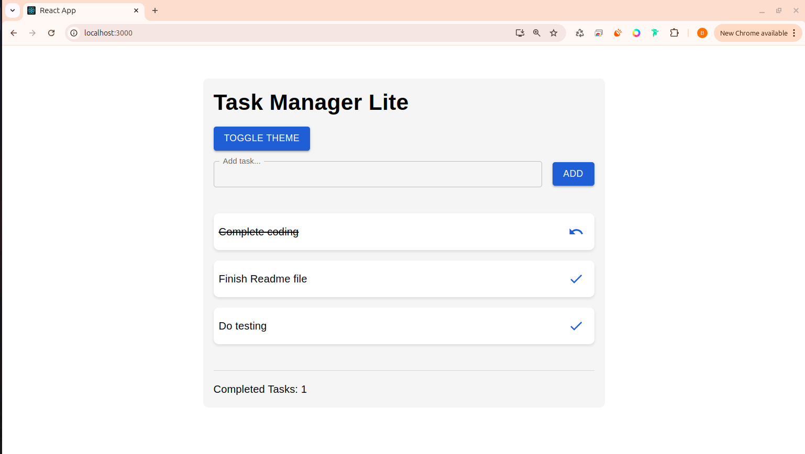
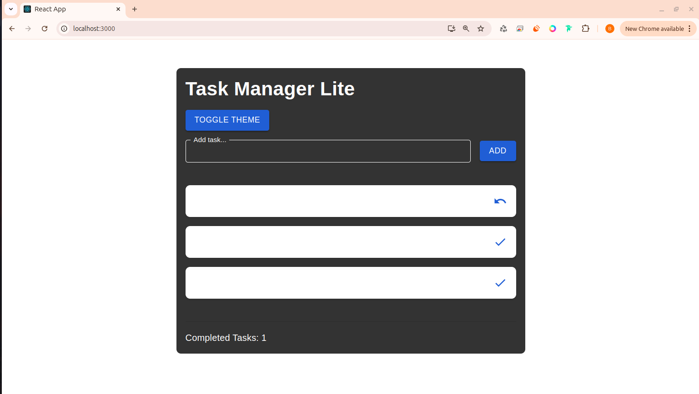

# Task Manager Lite

Task Manager Lite is a **React-based task management application** designed to help users efficiently manage their daily tasks. Built with **React v19**, this project demonstrates the use of the **React Context API** for state management and features a **light/dark theme toggle**. This repository is ideal for **junior developers** looking to learn **React**, **Context API**, and **modern UI design**.

## Project Overview

Task Manager Lite allows users to:
- Add new tasks to a task list.
- Toggle the completion status of tasks.
- View the count of completed tasks.
- Switch between **light** and **dark themes** for a personalized experience.

This project is a practical demonstration of **React's Context API**, **useReducer**, and **useMemo** hooks, making it a great learning resource for developers.

## Key Features

- **Add Tasks**: Quickly add tasks to your to-do list.
- **Toggle Completion**: Mark tasks as complete or incomplete with a single click.
- **Theme Toggle**: Switch between light and dark themes using a theme toggle button.
- **Completed Task Count**: Displays the number of tasks marked as completed.
- **Responsive Design**: The app is fully responsive and works seamlessly on all devices.

## Technologies Used

- **React v19**: A JavaScript library for building user interfaces.
- **React Context API**: For global state management (theme toggle).
- **Material-UI (MUI)**: A popular React UI framework for building modern, responsive designs.
- **CSS**: Custom styles for additional UI enhancements.

## SEO Keywords

- React Task Manager
- Task Management App in React
- React Context API Example
- Light and Dark Theme Toggle in React
- React useReducer and useMemo Hooks
- Material-UI Task Manager
- Responsive Task Manager App
- React Project for Beginners
- Task Manager with Theme Switcher
- React To-Do List Application

## Screenshots

Here are some screenshots of the application:

### Light Theme

### Dark Theme

> **Note**: Ensure the screenshots are placed in the `public/screenshots` directory with the filenames `light-theme.png` and `dark-theme.png`.

## Available Scripts

In the project directory, you can run:

### `npm start`

Runs the app in the development mode.\
Open [http://localhost:3000](http://localhost:3000) to view it in your browser.

The page will reload when you make changes.\
You may also see any lint errors in the console.

### `npm test`

Launches the test runner in the interactive watch mode.\
See the section about [running tests](https://facebook.github.io/create-react-app/docs/running-tests) for more information.

### `npm run build`

Builds the app for production to the `build` folder.\
It correctly bundles React in production mode and optimizes the build for the best performance.

The build is minified and the filenames include the hashes.\
Your app is ready to be deployed!

See the section about [deployment](https://facebook.github.io/create-react-app/docs/deployment) for more information.

## How to Contribute

We welcome contributions to improve Task Manager Lite! If you'd like to contribute:
1. Fork the repository.
2. Create a new branch for your feature or bug fix.
3. Submit a pull request with a detailed description of your changes.

## 📢 Share & Support

If you found this helpful, 🌟 **star the repo**, share with friends, and follow for updates!

## 🧑‍💻 Maintainer

**B. Balakrishna** — [LinkedIn](https://www.linkedin.com/in/balakrishna8524/) | [GitHub](https://github.com/Balakrishna8524/)

## License

This project is licensed under the MIT License. See the [LICENSE](LICENSE) file for details.

---

